# Startup Investment (Crunchbase) Analysis using MongoDB

## 👋 Introduction
Dataset yang dianalisis merupakan data Investment Venture Capital (VC), Angel Investor, maupun Seed Stage Investment terhadap beberapa Startup dari berbagai kategori market yang berbeda. Dataset ini dilansir dari halaman Kaggle, diambil dari situs Crunchbase. Crunchbase sendiri adalah platform untuk menemukan informasi bisnis tentang perusahaan swasta dan publik. Informasi Crunchbase termasuk informasi investasi dan pendanaan, anggota pendiri dan individu dalam posisi kepemimpinan, merger dan akuisisi, berita, dan tren industri.

Informasi yang berada pada dataset dapat digunakan sebagai alat bantu untuk menghadirkan ide-ide startup yang cemerlang, dimana saat ini hal tersebut mungkin terasa sulit bagi calon wirausahawan terutama ketika tampaknya semua orang sudah menyapu setiap ide bagus untuk bisnis. Tetap saja, sangat mungkin untuk menjadi sukses dengan memperbaiki produk yang ada atau memutar ide unik pada ide lama. Manfaat wirausaha dapat membuat upaya meluncurkan startup sangat bermanfaat. Selain kebebasan yang berasal dari menjadi bos Anda sendiri, memulai bisnis membawa lebih banyak kemandirian, kepuasan kerja yang lebih besar, dan potensi penghasilan yang berpotensi terbuka. Hal tersebut yang melatar belakangi kami memilih topik ini.

## 📕 Dataset
Kaggle Link: https://www.kaggle.com/arindam235/startup-investments-crunchbase

Total Data Original: 54.294

Total Data After Cleaning: 49.439

File Size (CSV/MongoDB): 11.95 MB / 43.49MB

## 🌈 Tools Usage
- MongoDB Atlas
- MongoDB Charts
- MongoDB Console

## 🦄 Credentials
### Database Access
    Username: whiterose
    Password: justforfun666ECorp
    Privileges: Read an Write

    Username: dosen
    Password: vPKyrGO0G9AlPAd4
    Privileges: Only Read

### Database Connection
#### Login to Database
    mongo "mongodb+srv://cluster0.01ube.mongodb.net/stratUp" --username whiterose
#### Import Dataset
    mongoimport --host atlas-wg6f26-shard-0/cluster0-shard-00-00.01ube.mongodb.net:27017,cluster0-shard-00-01.01ube.mongodb.net:27017,cluster0-shard-00-02.01ube.mongodb.net:27017 --ssl --username whiterose --password justforfun666ECorp --authenticationDatabase whiterose --db startUp --collection investments --type csv --file /home/ubuntu/StartUp-Investments-clean.csv --headerline

## 💻 Server Spesification
### Cloud Server (MongoDB Atlas)
- Provider: Amazon Web Services (AWS)
- Region: Singapore (ap-southeast-1)
- Cluster Tier: M0 Sandbox (Shared RAM, 512 Storage)
- MongoDB Version: 4.2
- Auto Backup: No
- Cluster Name: Cluster0
### Client (MongoDB Console)
- Provider: Amazon Web Services (AWS) / Amazon Lightsail
- Region: Seoul, South Korea (ap-southeast-2)
- Memory: 32 GB
- Processing: 8 vCPUs
- Storage: 640 GB SSD
- Transfer: 7 TB

## 🔥 Query Performance Analysis
Performa eksekusi query dari database, dengan daftar query pada method API: find(), shord(), dan aggregat (sum, avg, min, dan max). Pertama, kami akan menambahkan sebuah fungsi untuk menghitung sebuah query dijalankan. Untuk menambahkan fungsi tersebut kita menambahkan code program dibawah pada file ```.mongorc.js```.

```javascript
function time(command) {
    const start = new Date();
    const result = command();
    const end = new Date();
    print("Execute Time: " + (end - start) + "ms");
    return result; 
}
```

Sehingga untuk menjalankan sebuah query akan seperti ini nantinya:

```javascript
time(() => db.coll.aggregate(...))
```

Namun, fungsi ini tidak cocok digunakan pada method ```find()```, sehingga untuk method ```find()``` akan menggunakan ```explain("executionStats")``` untuk dapat melihat statistik berapa lama waktu yang dibutuhkan untuk menyelesaikan sebuah query.

### 1. Method: find()
-------------

#### Get All Data

Query di bawah akan menampilkan semuda data yang ada pada dataset secara keseluruhan.

```javascript
db.investments.find().explain("executionStats")
```
- Total Returned Data: **49.438**
- Execution Time: **16ms**
- Screenshot:


#### Get Startups Since 2000

Untuk mendapatkan data seluruh startup yang berdiri dari tahun 2000 dapat menggunakan query di bawah. Untuk hal tersebut dibutuhkan pemfilteran dengan menambahkan query operator ```$gte```. Dengan menambahkan operator atau filter tambahan pada method find execution timenya menjadi lebih besar dari pada tanpa menggunakan operator atau filter tambahan, hal ini terjadi karena akan diperlukan pengecekan pada dokumen untuk dapat menampilkan data yang sesuai dengan filter atau operator yang ditentukan.

```javascript
db.investments.find(
    { founded_year : { $gte: 2000 } }
).explain("executionStats")
```
- Total Returned Data: **34.823**
- Execution Time: **29ms**
- Screenshot:

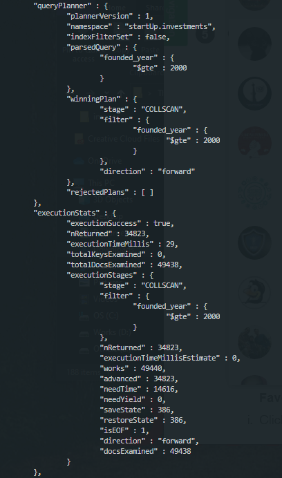

#### Get All Market Category

Kita akan coba mengecek market apa saja yang sebenarnya ada dalam dataset tersebut. 

```javascript
time(() => db.investments.distinct("market"))
```

Untuk mengecek berapa jumlah data yang ditampilkan

```javascript
time(() => db.investments.distinct("market").length)
```

- Total Returned Data: **754**
- Execution Time: **240ms**
- Screenshot:

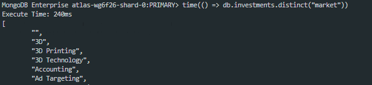

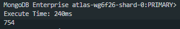

Maka diketahui bahwa terdapat sebanyak **754** kategori market yang dimainkan oleh startup - startup yang ada. Untuk performa querynya sendiri dari query yang sebelumnya execution timenya lebih banyak hal ini dikarenakan dengan menggunakan ```distinct``` data yang sama tidak akan ditampilkan.

### 2. Method: sort()
-------------


### 3. Method: aggregat()
-------------

#### Get Total Startup in Each Market
```javascript
time(() => db.investments.aggregate( 
    {$group : { _id : { "market" : "$market", "name" : "$name" }, startup : { $sum : 1 } } }, 
    {$group : { _id : "$_id.market", startup : { $sum : 1 } } } 
).toArray())
```
- Total Returned Data: **754**
- Execution Time: **577ms**
- Screenshot:

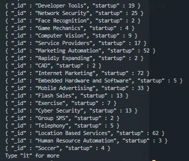

#### Get Current Startup Status
```javascript
time(() => db.investments.aggregate( 
    {$group : { _id : { "status" : "$status", "name" : "$name" }, startup : { $sum : 1 } } }, 
    {$group : { _id : "$_id.status", startup : { $sum : 1 } } } 
))
```
- Total Returned Data: **4**
- Execution Time: **276ms**
- Screenshot:

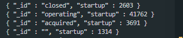

#### Get Information About Top Maximum Funding in Each Market at Serie A
```javascript
time(() => db.investments.aggregate( 
    {$group : { _id : "$market", maxFundingSerieA: { $max: "$round_A" } } },
    {$sort : { maxFundingSerieA : -1 } }
))
```
- Total Returned Data: **20**
- Execution Time: **185ms**
- Screenshot:

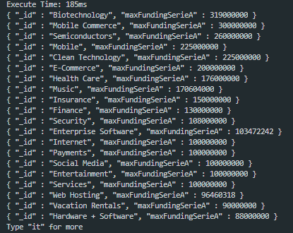

#### Get Information About Top Minimum Funding in Each Market at Serie A
```javascript
time(() => db.investments.aggregate( 
    {$group : { _id : "$market", minFundingSerieA: { $min: "$round_A" } } },
    {$match : { minFundingSerieA : {$ne : 0} } },
    {$sort : { minFundingSerieA : 1 } }
))
```
- Total Returned Data: **20**
- Execution Time: **186ms**
- Screenshot:

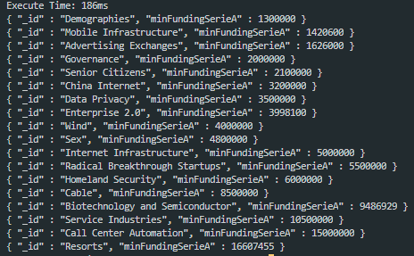

#### Get Information About Average Funding in Each Market at Seed Stage
```javascript
time(() => db.investments.aggregate( 
    {$group : { _id : "$market", avgFunding: { $avg: "$seed" } } },
    {$match : { seed : {$ne : 0} } },
    {$sort : { avgFunding : -1 } }
))
```
- Total Returned Data: **20**
- Execution Time: **181ms**
- Screenshot:

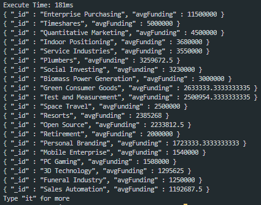

## 👨‍🔬 Data Analysis
### 1. Data Cleaning
-------------
Sebelum melakukan sebuah analisis perlu untuk melakukan pengecekan pada dataset apakah dataset tersebut sudah baik untuk digunakan. Setelah dilihat terdapat beberapa row data yang valuenya NaN atau kosong semua. Sehingga disini diperlukan pembersihan data (Data Cleaning) dengan cara menghapus data - data tersebut yang tidak terpakai. Untuk melakukan data cleaning kami menggunkan simple code PHP untuk melakukan pengecekan setiap row datanya memiliki field ```name``` atau tidak, jika didalam row tidak terdapat field ```name``` data row tersebut akan dihapus. Untuk melalukan data cleaning gunakan perintah:

```bash
php cleaner
```

Output yang didapatkan adalah kita memiliki jumlah data sebanyak **49.439 dari 54.294** data sebelumnya.

### 2. Quick Analysis
-------------
**Hal - hal yang diketahui:**
1. Jumlah startup sangatlah condong ke kiri dimana pada data ini condong ke 3 negara yaitu US, GBR dan CAN. 3 negara tersebut menyumbang paling banyak data startup pada dataset ini.
2. Dataset memiliki data startup yang berdiri dari tahun **1902 hingga 2014**.
3. Sebagian banyak stratup yang ada pada dataset ini masih berjalan sampai saat ini.
4. Analisis pada dataset ini dapat memberikan gambaran mengenai pengembangan startup yang dapat dilakukan maupun sebagai gambaran terhadap investor untuk sebagai bahan pertimbangan memberikan funding.

#### Startups Founding Year

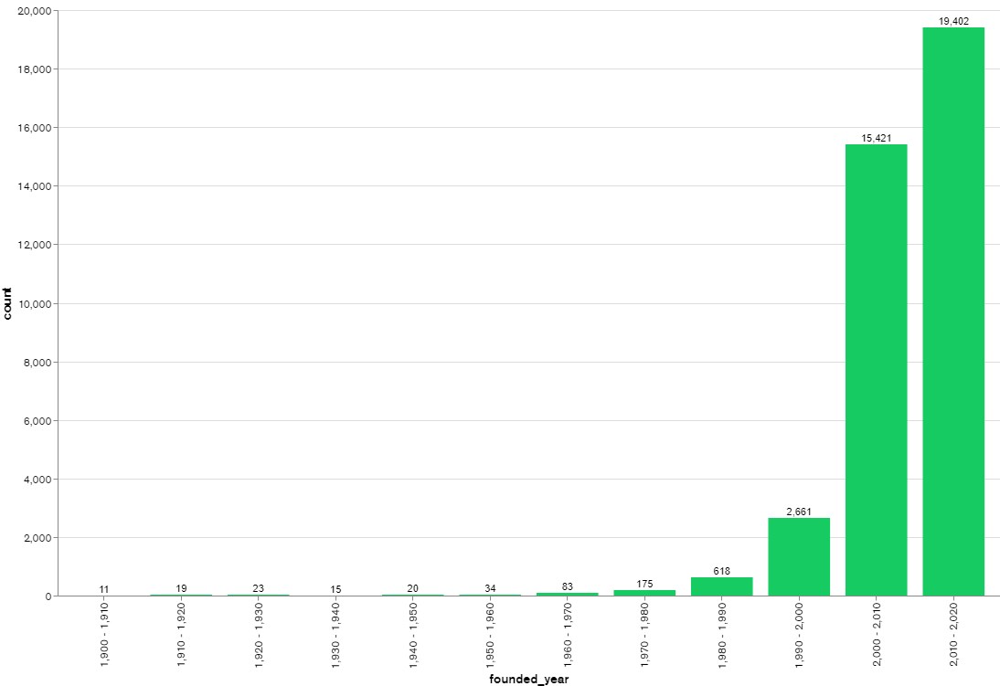

Dari chart di atas dapat diketahui bahwa pertumbuhan startup tiap tahunya semakin pesat ditunjukan dengan block chart yang semakin naik. Dimana pada rentang tahun 2000 - 2014 pertumbuhan stratup sangatlah pesat.

#### Startups Since 2000

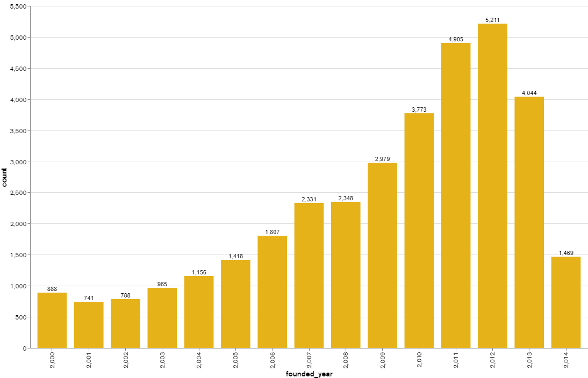

Pertumbuhan startup - startup baru dari tahun 2000 secara lebih jelas dapat dilihat pada chart diatas. Dari chart tersebut pertumbuhan startup terbanyak terjadi pada tahun **2012** dimana terdapat **5211** startup baru berdiri, kemudian dari tahun 2000 sampai 2015 tren pertumbuhan startup naik. Namun, pada tahun 2013 sampai 2014 pertumbuhan startup menunjukan penurunan. Hal ini dapat dipengaruhi oleh beberapa sebab.

#### Distribution of Startup Across Countries

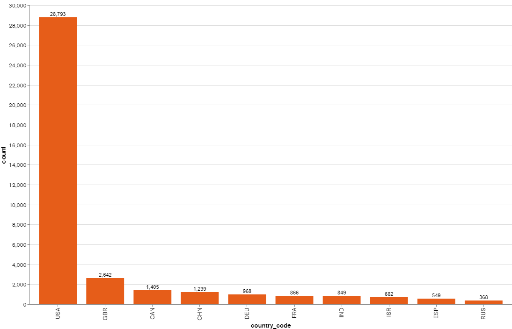

Pendistribusian startup berdasarkan negara dikuasai oleh Amerika Serikat dengan memiliki startup 28793 startup yang telah berdiri. Kemudian diikuti United Kingdom dan Canada dibelakangnya.

#### Top States for Startup in USA

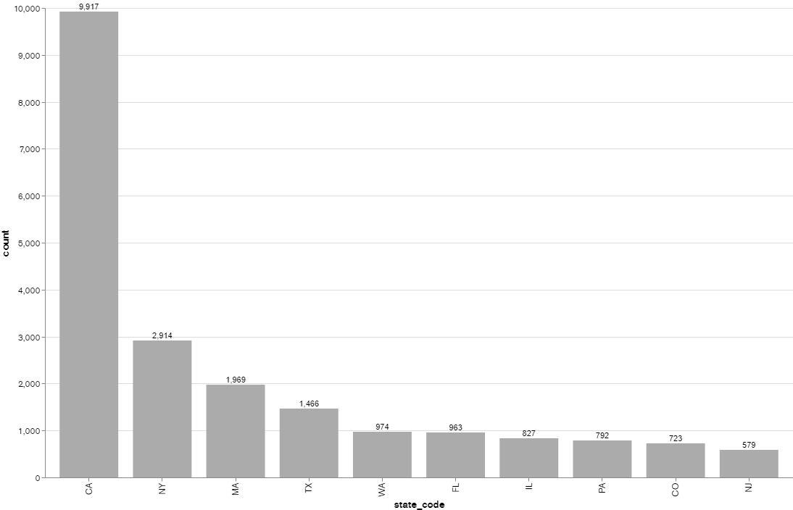

California memiliki jumlah startup maksimum dibandingkan dengan semua negara bagian lain di Amerika Serikat (USA).

#### Status of Startups

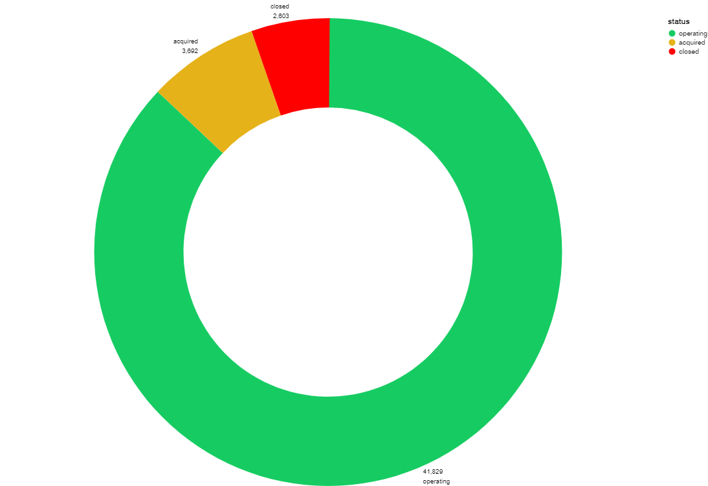

Sebagain besar startup masih terus berjalan (operating), dan sebanyak 2.603 startup sudah ditutup (closed). Dari halaman Kaggle sendiri dataset terakhirkali diperbarui pada tanggal **18-02-2020**.

### 3. Market and Status
-------------
**Hal - hal yang diketahui:**
1. Kategori market yang paling banyak dimainkan oleh perusahaan startup diantaranya adalah Software, Biotechnology, dan Mobile.
2. Di USA dengan pendistribusian startup terbesar tren marketnya hampir sama dengan tren market keseluruhan.
3. Market software adalah market yang paling banyak startup tutup (closed). Namun, ini dipengaruhi karena market software adalah market terbesar yang banyak dimainkan oleh startup sehingga diperlukan analisa lebih lanjut.
4. Market software juga merupakan market yang sering diakuisisi (acquired)

#### Top Startup Market Leaders

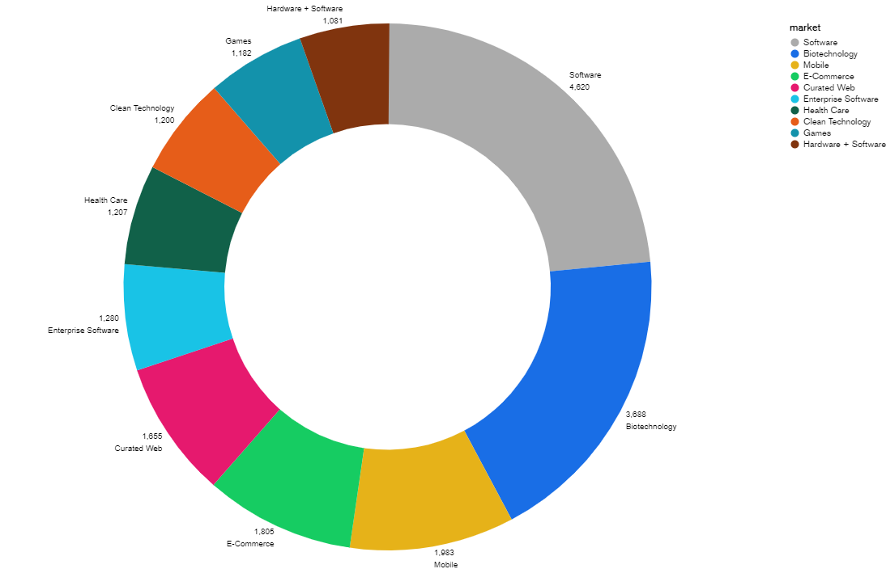

Untuk secara global, sebagian besar tren market startup adalah tentang Software & Teknologi

#### Top Startup Market Leaders in Amerika Serikat (USA)

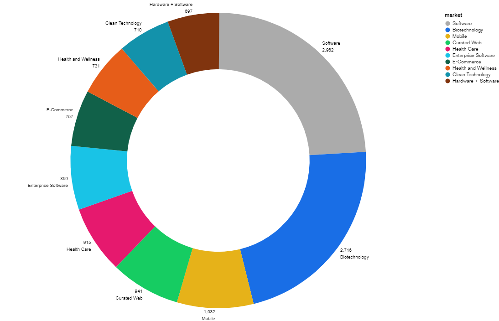

Sementara itu di Amerika Serikat (USA) tren market startup hampir sama dengan tren market global.

#### Top Startup Market Leaders in Indonesia (IDN)

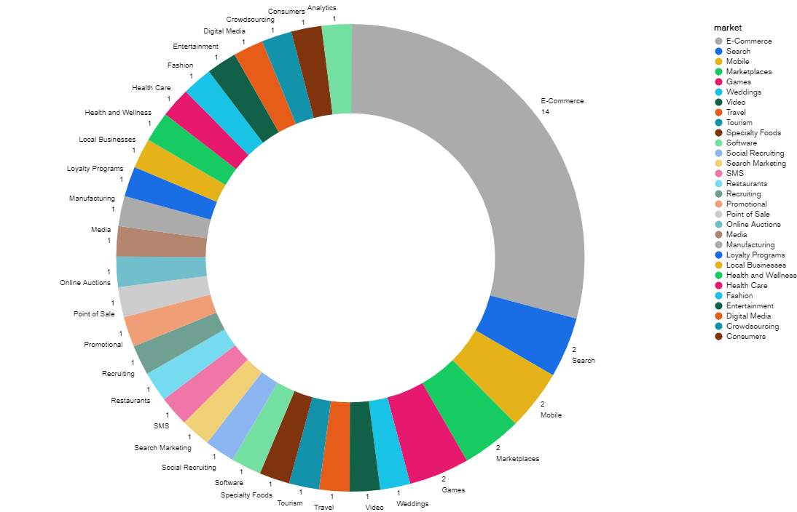

Sebagai perbandingan di Indonesia (IDN) tren market startup tertuju pada E-commerce. Dua chart ini menunjukkan betapa berbedanya tren minat antara Amerika Serikat (USA) dan Indonesia (IDN)

#### Markets That Most Startups Closed

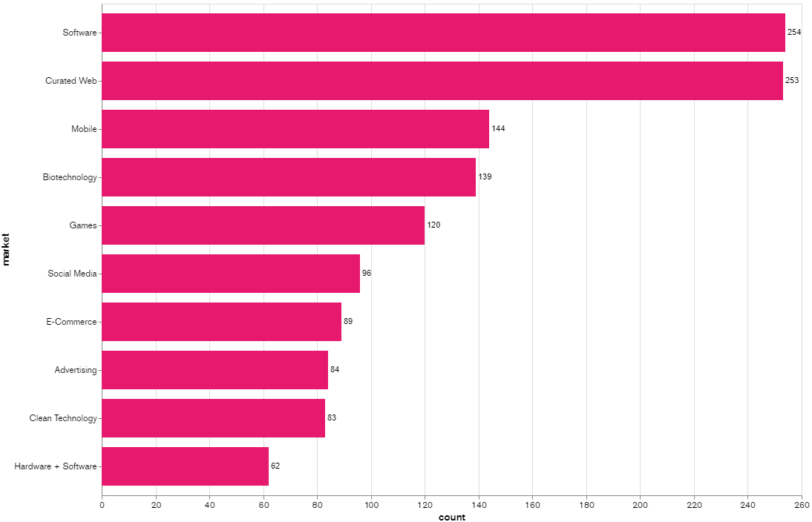

Market yang sebagian besar perusahaan startup ditutup dipimpin oleh market Software, Curated Web dan Mobile

#### Markets That Most Startups Acquired

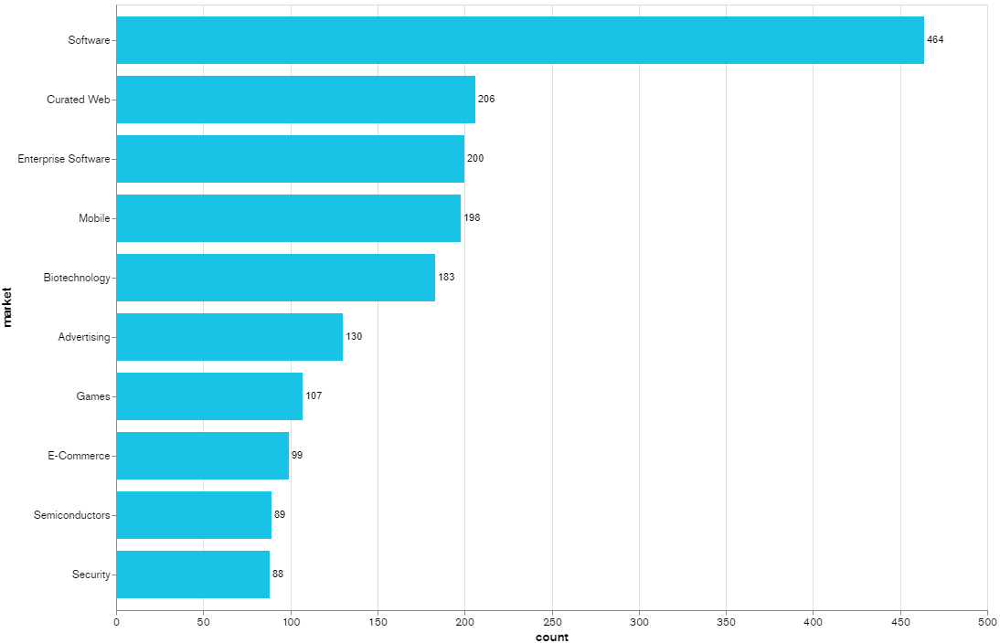

Market yang sebagian besar perusahaan startup diakusisi, disini dipimpin oleh Software, Curated Web dan Enterprise Software

### 4. Fundings
-------------
**Hal - hal yang diketahui:**
1. Biotechnology merupakan market startup yang paling banyak mendapatkan pendanaan dari Series round A - H. Hal ini dapat menunjukan bahkan pergerakan bisnis kedepanya akan mulai terfokus pada pengembangan biotechnology ini.
2. Market yang mendapatkan pendanaan terbesar pada Seed Stage adalah market software dengan jumlah pendanaan sebesar 853,923,812 USD. Seed Stage merupakan fase dimana startup telah menentukan solusi untuk permasalahan yang sudah divalidasi (Validate Idea). Selama menjalani fase seed stage, startup akan berfokus dalam pembuatan dan pengembangan produk / MVP.
3. Sementara itu, ANgel Investor lebih banyak berinvestasi pada market Mobile berbanding tipis dengan market Software.

#### Top Market Funding in Round A - H

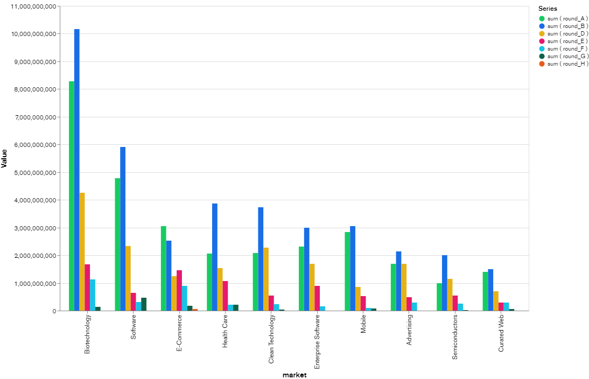

#### Top Market Funding in Seed Stage

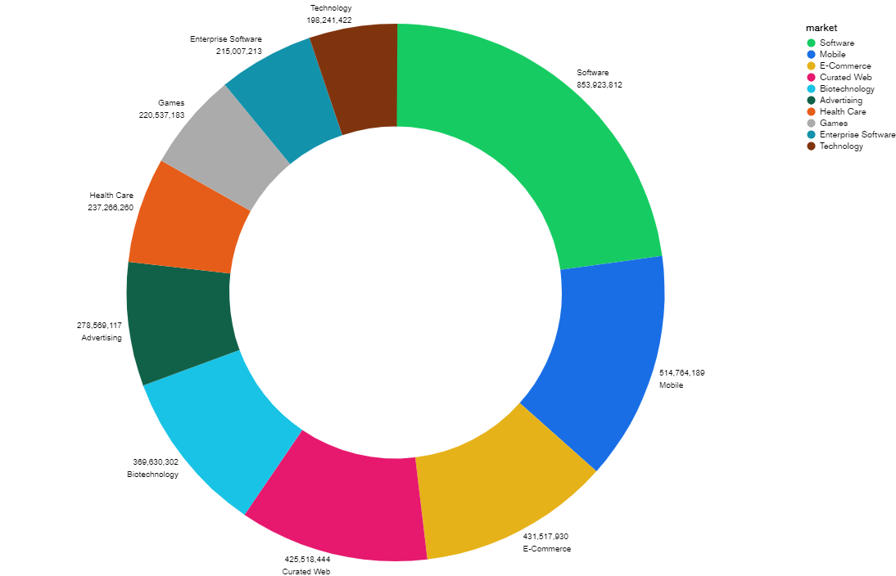

#### Top Market Funding by Angel Investor

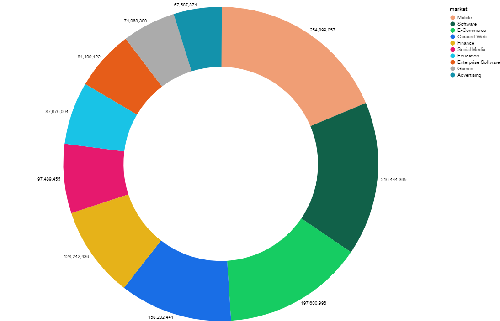

## 💎 Conclusion & What We Can Get ?
Market startup secara global dikuasai oleh pengembangan perangkat lunak (software) dan startup sendiri berkembang sangat pesat di negara Amerika Serikat (USA), United Kingdoom (GBR), Canada (CAN) dan China (CHN). Tren yang ada di Indonesia dari dataset yang tersedia adalah tren market E-commerce.

Dari analisis diatas terdapat peluang pada market Biotechnology dimana market ini paling banyak mendapatkan pendanaan pada Serie A - H, terlebih lagi jika diterapkan di Indonesia market ini masihlah belum ada pesainnya. hal tersebut menjadikan market Biotechnology merupakan market yang dapat diambil untuk pengembangan bisnis, namun perlu diketahui juga market Biotechnology ini memilikmi peluang yang kecil untuk mendapatkan pendanaan dari Angel Investor. Sebagai cara mengatasi pencarian pendanaan dari Angel Investor yang mungkin susah pada market Biotechnology kita dapat mengajukan pendanaan pada Seed Stage untuk pendanaan awal dilihat dari analisis yang ada.

## ⚠️ Disclaimer
***Note: modifications, changes, or alterations to this sourcecode is acceptable, however,any public releases utilizing this code must be approved by writen this application ( - Imam Kusniadi - ).***
